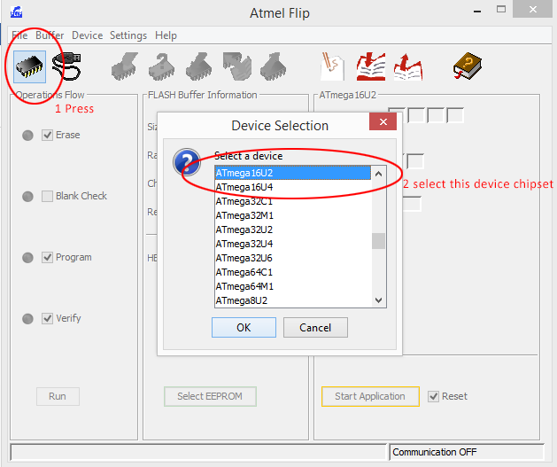
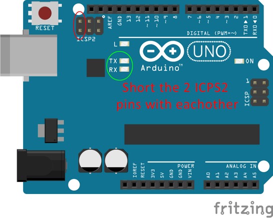
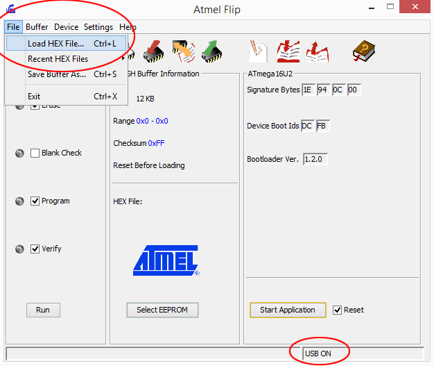
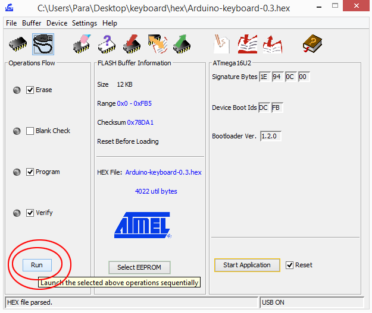

  
  <h1>Uno Macro Keyboard</h1>
  
  

    Got an Uno lying around you can't find a use for? Turn it into a Macro Keyboard!
  

  
  
   
<h4>

 

<!-- Table of Contents -->
# :notebook_with_decorative_cover: Table of Contents

- [About the Project](#star2-about-the-project)
  * [Features](#dart-features)
- [Getting Started](#toolbox-getting-started)
  * [Prerequisites](#bangbang-prerequisites)
  * [Installation](#gear-installation)
- [License](#warning-license)
- [Contact](#handshake-contact)
- [Acknowledgements](#gem-acknowledgements)

  

<!-- About the Project -->
## :star2: About the Project

This project aims to turn a Uno into a Keyboard. Yes, Its waaaay easier to use a Leonardo for a project like this. But if you want to get an Uno out of your sight, this is a great project if a bit hacky.

<!-- Getting Started -->
## 	:toolbox: Getting Started

<!-- Prerequisites -->
### :bangbang: Prerequisites

This project requires the use of the Arduino IDE, and FLIP. I have included an exe for FLIP in the repo. I encourage you to obtain the file from a trusted source if you do not trust me, or at the very least perform due diligence before running the .exe: I've simply included it as a convenience, both for myself should I want to make another, or for someone who may stumble upon this project.

Arduino IDE can be obtained from

https://www.arduino.cc/

<!-- Wiring -->
### :gear: Wiring
I was lazy and decided to use the internal pull up resistor so I didnt have to use an external resistor, if your button configuration includes an external pull-up or pull-down resistor you may need to make changes to this code.

<!-- Installation -->
### :gear: Installation

Once you have both the software and the and your Uno ready: 
1. Before you flash the uno_keyboard.ino file, find the code which has been commented out: (Serial.println(.....)   
remove the "//" from each instance under every button.  

2. Make any changes to pin definitions or rgb values and go ahead and flash the code  

3. Open the serial monitor: Tools -> Serial Monitor  

4. Now press every button you have wired to see if you get a serial read out for each

5. If all buttons work, you can proceed if not check your wiring. If your wiring is good then you may need to change the HIGH LOW INPUT_PULLUP values in the code, retry until you get an output.

6. once all your buttons are confirmed to work you can re-comment these lines or remove them all-together. Then reflash your Uno.

7. Go ahead and install FLIP or launch the program if you've already installed.  

8. When starting up you get the error "AtLibUsbDfu.dll not found". Simply drag the dll file from the Flip install folder of this repo into your Flip install "usb" folder.

	https://www.youtube.com/watch?v=KQ9BjKjGnIc

	This youtube video can provide further guidance if you have issues.

9. Flip Device Selection
  
    
  
Press the Highlighted chip button, then Select ATmega16u2 and then the OK button.

10. Short the 2 ICSP2 pins to enter the UNO into DFU mode.
  
    
  

11. Connect to the Unos ATMEGA
  
    
  
12. Load the Uno Keyboard hex file
  
    
  
13. Now run Flip
  
    
  
14. Re-plug the arduino Uno and see if your keyboard shortcuts work!

15. When you flash you keyboard hex file you can no longer upload code via the arduino IDE, should you wish to restore this functionality simply repeat steps 9-13, but instead use the other hex file in that directory.

<!-- License -->
## :warning: License

Distributed under the GPLv3 License. See LICENSE.txt for more information.

<!-- Contact -->
## :handshake: Contact

Oskar Petersen - [@ock666](https://github.com/ock666) - koreaserpents.xyz

<!-- Acknowledgments -->
## :gem: Acknowledgements

Use this section to mention useful resources and libraries that you have used in your projects.

 - [Eward Hage](https://www.instructables.com/How-to-Make-a-Arduino-HID-Keyboard/)
 - [Awesome README](https://github.com/matiassingers/awesome-readme)
 - [FortStudios](https://www.instructables.com/Arduino-UnoLeonardo-Keyboard-Macro-Box/)

